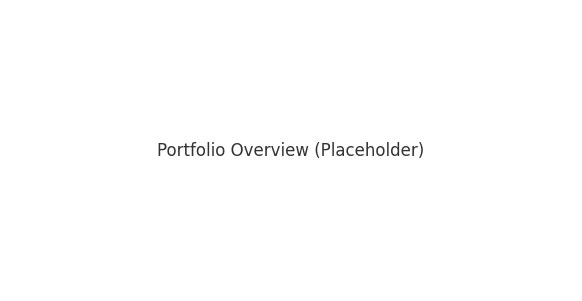
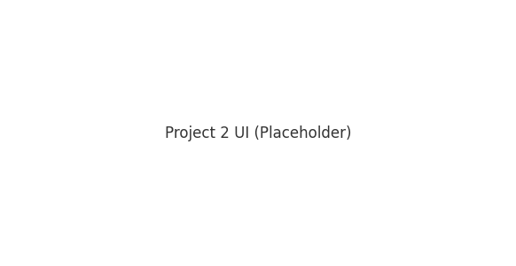
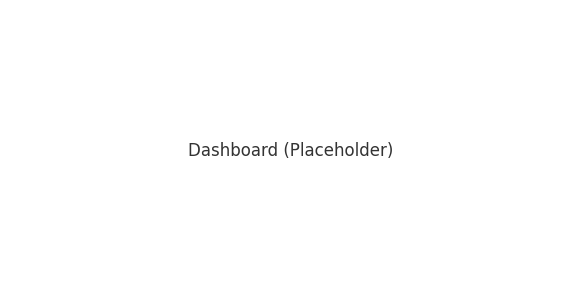

# AI PM Portfolio — Richa Srivastava

Anthropic-aligned portfolio demonstrating **onboarding & discoverability**, **safety-aware RAG**, and a **metrics/eval** practice. Optional Claude/OpenAI calls with safe fallbacks are wired in.



## Contents
- **Project 1 — First 5 Minutes to Value**: A/B/C onboarding variants to reduce time-to-first-success and improve early retention.  
  
- **Project 2 — Safety-aware RAG**: Confidence gating, citations, refusals, and clarify flows to reduce hallucinations.  
  
- **Dashboard**: Latency & eval distributions for quick readouts.  
  
- **Templates**: PRD, experiment readout, risk register, metrics schema, interview script.
- **Papers**: Drafts you can publish: assistance quality, discoverability patterns, and cost×latency×quality budgets.

## Quickstart
```bash
python -m venv .venv && source .venv/bin/activate
pip install -r requirements.txt

# Project 1 (onboarding experiments)
streamlit run projects/01-first-five-minutes/app_streamlit/app.py

# Project 2 (safety-aware RAG)
streamlit run projects/02-safety-aware-rag/app_streamlit/app.py

# Offline evals
python projects/01-first-five-minutes/app_streamlit/evals/run_evals.py
python projects/02-safety-aware-rag/app_streamlit/evals/run_evals.py

# Dashboard
streamlit run dashboard/streamlit_dashboard.py
```

## Optional: Use real models (Claude/OpenAI)
- Set `ANTHROPIC_API_KEY` (and optionally `ANTHROPIC_MODEL`) **or** `OPENAI_API_KEY` (and `OPENAI_MODEL`).
- Calls automatically fall back to a mock response if keys are missing or errors occur.
- Code for this lives in `common/model_clients.py`.

## KPIs & Evals (Snapshot)
- **Activation:** p50 TTV < 120s; task_success ≥ 65%; +8pp 48h return
- **Quality/Safety:** accuracy ≥ 80%; hallucination ≤ 2–3%; refusal appropriateness ≥ 95–98%
- **Latency:** p95 ≤ 2.5–3s
- **Ops:** tokens/user & cost tracking with guardrails

## Loom Demos (placeholders)
See `assets/loom_links.md` and replace with your recordings.

---

**Owner:** Richa Srivastava • Created 2025-08-17
